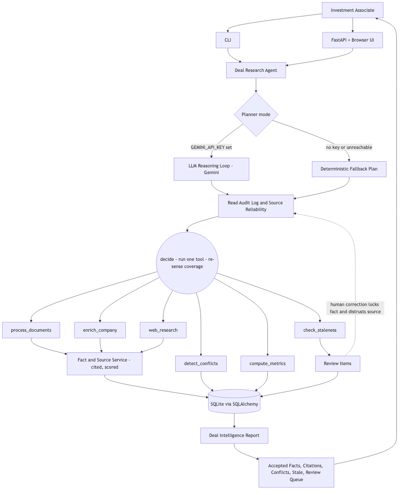
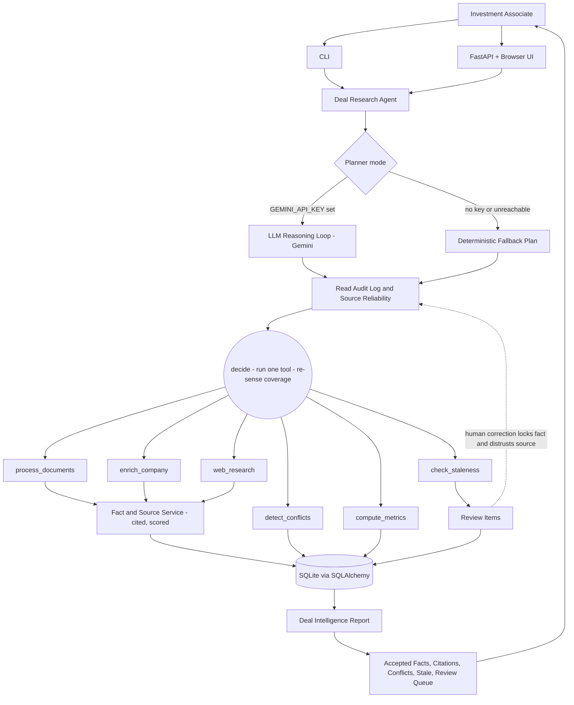
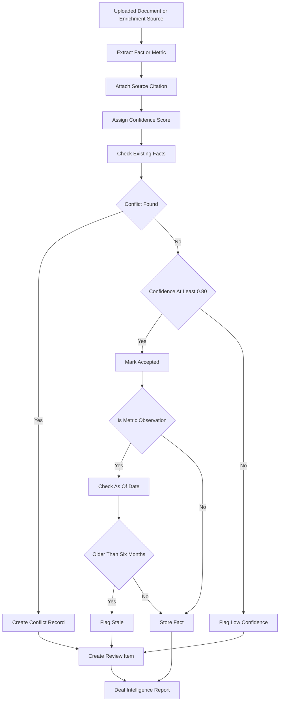

# AI Deal Room Architecture

## MVP Persona

The primary user is an Investment Associate or Analyst doing due diligence on early-stage technology companies.

The prototype optimizes for one workflow: update a deal's intelligence from local documents and mocked company enrichment, then produce a cited report with accepted facts, review flags, stale data, conflicts, and computed metrics.

## System Diagram



(Source below; renders automatically on GitHub.)



## Core Data Model

- `companies`: company identity and enriched profile.
- `deals`: active investment opportunity and stage metadata.
- `documents`: local uploaded deal documents.
- `document_chunks`: text chunks used for citation references.
- `facts`: atomic extracted or enriched claims.
- `fact_sources`: provenance for every fact.
- `metric_observations`: temporal business metrics like ARR, headcount, burn, and valuation.
- `computed_metrics`: derived values like ARR valuation multiple.
- `conflicts`: contradictory facts requiring manual reconciliation.
- `review_items`: Associate work queue for conflicts, low confidence, and stale data.
- `agent_runs`: audit trail of every planning run (tools used, full trace, status incl. `failed`).
- `deal_events`: append-only change log (old → new value, source, provider, reason); the source-reliability loop reads this to learn which providers were corrected.

`facts` and `metric_observations` carry a `locked` flag: human-authored,
canonical values that survive agent re-runs and suppress competing
re-extractions for the same field.

## Data Schema Design

The schema intentionally separates **stable workflow fields** from **dynamic company intelligence**.

Stable workflow fields become typed columns because the product will filter, sort, and report on them often. Dynamic diligence facts become fact/metric observations because new fields will keep appearing across early-stage companies.

### Fixed Core Tables

`companies`

| Field | Purpose |
|---|---|
| `company_id` | Stable internal identifier. |
| `name` | Company name. |
| `website` | Company website. |
| `sector` | Broad sector, e.g. FinTech, Climate, AgTech. |
| `geography` | Primary geography. |
| `summary` | Short company description from enrichment or documents. |

`deals`

| Field | Purpose |
|---|---|
| `deal_id` | Stable internal deal identifier. |
| `company_id` | Link to company. |
| `stage` | Current deal stage. |
| `owner` | Associate or deal owner. |
| `source` | How the deal entered pipeline. |
| `priority` | High / Medium / Low. |
| `status` | Active / Closed / Passed / Paused. |
| `initial_contact` | Founder, investor, or intro contact. |

`documents`

| Field | Purpose |
|---|---|
| `document_id` | Stable document identifier. |
| `deal_id` | Link to deal. |
| `filename` | Uploaded file name. |
| `doc_type` | Pitch deck, term sheet, memo, financials, contract, etc. |
| `storage_path` | Local path in the MVP. |
| `processing_status` | Pending / processed / failed. |

### Dynamic Intelligence Tables

`facts`

Used for one-off or semi-structured claims:

- founding year
- founders
- LinkedIn URLs
- accelerator participation
- lead investor
- customer names
- market position
- risks
- product category

`metric_observations`

Used for time-varying quantitative metrics:

- ARR
- revenue
- headcount
- valuation
- monthly burn
- runway
- gross margin
- revenue growth

Each observation has `as_of_date`, source citation, review status, and staleness status.

`computed_metrics`

Used for values derived from observations:

- ARR valuation multiple
- annual burn as percent of ARR
- growth rates
- burn multiple

Computed metrics inherit stale/conflict/review flags from their inputs.

### Deal Stage Model

For the MVP, `deals.stage` is a simple enum-like string:

| Stage | Distinct tracking needed |
|---|---|
| `Sourced` | Basic company identity, website, source, initial contact. |
| `Screening` | Sector fit, founder/team notes, market summary, obvious pass reasons. |
| `Due Diligence` | Documents, extracted metrics, conflicts, stale data, review queue. |
| `IC Review` | Investment memo fields, computed metrics, key risks, open diligence items. |
| `Term Sheet` | Valuation, round terms, lead/co-investors, legal docs. |
| `Closed` | Final terms, ownership, investment date, post-close tracking. |
| `Passed` | Pass reason, stage at pass, reusable learnings. |

In a fuller system, I would add a `deal_stage_events` table:

```text
deal_stage_events(event_id, deal_id, from_stage, to_stage, changed_by,
                  changed_at, reason, notes)
```

I did not implement that table in the MVP because the prototype focuses on the Associate's due-diligence intelligence workflow, not multi-user pipeline history. It should be called out as an obvious production extension.

### Founder, Team, and Accelerator Data

These are reasonable fields for early-stage venture, but they should not all become columns on `companies`.

Recommended model:

```text
company_people(person_id, company_id, name, role, linkedin_url,
               source_id, review_status, created_at)

company_signals(signal_id, company_id, signal_type, value_text,
                source_id, as_of_date, review_status, created_at)
```

Examples:

- `company_people`: founder, CEO, CTO, CFO, board member.
- `company_signals`: accelerator participation, notable investor, customer logo, regulatory license, press mention.

For the MVP implementation, those are represented as dynamic `facts` so the prototype remains small. For production, I would promote repeated/high-value fact types into typed tables once the team proves they are queried often.

## Handling New Fields

The common-denominator strategy is:

1. Put stable workflow fields in typed tables.
2. Put evolving company claims in `facts`.
3. Put time-series numeric values in `metric_observations`.
4. Promote dynamic facts into typed tables only after they become common, high-value, and frequently queried.

This avoids two bad extremes:

- A rigid schema that cannot handle new diligence fields.
- A pure key-value store where everything is flexible but nothing is reliable or easy to query.

For example:

- `stage`, `owner`, and `priority` are typed deal fields.
- `ARR`, `headcount`, and `valuation` are metric observations because they change over time.
- `YC batch`, `founder LinkedIn`, and `notable investor` can start as facts/signals.
- If founder tracking becomes central, promote it to `company_people`.

## Agent Decision Logic

The agent has two planning modes behind one interface (`decide(context) ->
Decision`):

1. **LLM reasoning loop (`LLMReasoningPlanner`, default when `GEMINI_API_KEY`
   is set).** A genuine agentic loop: the model is given the objective, the
   open coverage gaps, the providers a human previously corrected, and the
   observations from tools already run, and it chooses the single next tool
   from a catalog (`process_documents`, `enrich_company`, `web_research`,
   `detect_conflicts`, `compute_metrics`, `check_staleness`, `finish`). The
   loop executes that tool, **re-senses** the deal, and asks again — up to a
   step cap. Every decision and its rationale is logged to the run trace.
2. **Deterministic plan (fallback).** When no key is configured, the model is
   unreachable, or for reproducible tests/demos, the agent uses the
   stage-aware checklist below. If the LLM planner fails before doing useful
   work, the run **degrades to this path** rather than returning empty.

The key design choice: the **planner (model) owns control flow** — which tool,
in what order, when to stop — while the **tools are deterministic and own fact
production** — extraction, citation, confidence, conflict-flagging. The model
can reorder, skip, or react to findings, but it can never emit a value without
a cited tool behind it. That keeps reasoning adaptive while every resulting
fact stays auditable. As the tool/source catalog grows, the loop absorbs new
tools by description; a deterministic `if/else` tree would grow combinatorially.

### Source-reliability feedback loop

Before planning, the agent reads the deal's `DealEvent` audit log via
`SourceReliabilityService`. Any provider/source a human previously *corrected*
on this deal is distrusted: its other facts are routed to review (with an
explaining reason) instead of auto-accepted. This is how the agent learns from
being wrong and feeds that learning into future runs.

### Durability across runs

A run rebuilds agent-derived intelligence but **preserves human-authored
(`locked`) facts and observations, resolved review items and conflicts, and the
`agent_runs` audit trail**. A locked field is canonical: the agent will not
re-extract or re-flag it, so an associate never re-validates a settled value.
The whole run is one transaction; a failure rolls back and records a `failed`
run for traceability.

### Deterministic plan (fallback detail)

Initial plan:

- If diligence documents are available, run `extract_document_facts`.
- If company profile fields are missing, run `enrich_company`.
- Compare the current deal state against required fields for the current stage.
- Choose source lanes for missing or weak fields:
  - company/founder-controlled sources for sector, geography, founders, and market positioning
  - funding/news-style sources for latest round and external investors
  - attached diligence materials for ARR, burn, headcount, valuation, runway, and term-sheet fields
  - associate clarification when the company identity or required field cannot be resolved

Follow-up plan after extraction:

- If important fields are missing, run `web_research`.
- If metrics are stale, run `web_research` to look for fresher context.
- If sources conflict, run `web_research` to gather external context, but do not let web results overwrite deal documents.
- If web research cannot confidently identify the company, create a clarification review item and continue processing other available sources.
- If multiple web sources corroborate the same public fact, allow the fact to be accepted with citations; otherwise route it to review.
- Always run conflict detection and computed metrics after structured facts are persisted.

This is intentionally simple, but it demonstrates the required agent behavior: it chooses tools based on state, uses different data sources for different problems, and adjusts after findings like stale metrics or conflicting valuations.

## Agent UX

The UI is organized around the Associate's workflow:

1. Pipeline page: Kanban-style view of companies by stage, with Add Company.
2. Deal page: current deal state, editable fields, diligence materials, and two primary actions: Run Agent and Upload More Documents.
3. Agent output: action sequence, coverage gaps, source strategy, citations, accepted facts, review items, and computed metrics.
4. Review resolution: the Associate can type a correction in natural language. The backend normalizes the input into the same fact/metric schema and records whether the agent suggestion was resolved by a human correction.

This keeps the agent trustworthy: it shows what it tried, why it picked a source, what it accepted, and what still needs human judgment.

## Document Parsing Strategy

The MVP uses multiple parser lanes that all emit the same `ExtractedFact` contract:

- deterministic regex for clean `Label: value` text documents (the seed
  documents use this format; it is fast, free, and verifiable)
- Gemini Flash text fallback for fields the regex lane missed, when
  `GEMINI_API_KEY` is configured
- PDF text extraction via `pypdf`
- spreadsheet text normalization via `openpyxl`
- image/screenshot extraction via Gemini multimodal support when `GEMINI_API_KEY` is configured

The regex lane is deliberately format-locked to the demo documents; for
arbitrary real-world documents the Gemini lane is the path that generalizes.
The two-lane order (deterministic first, LLM only for the gaps) keeps cheap,
auditable extraction in front and pays for the model only where it adds value.

Uploaded documents can be labeled fuzzily by the Associate, e.g. `email screenshot`, `handwritten note`, `Excel sheet`, or `CSV`. The label is normalized into `documents.doc_type`; future parser selection can use that value to route the document to OCR, vision extraction, spreadsheet normalization, or document-specific extraction.

Production hardening should include a small evaluation set:

- 3-5 pitch decks
- 3-5 term sheets
- 3-5 financial spreadsheets
- 3-5 email screenshots or handwritten notes
- expected extracted facts, citations, and review decisions

That evaluation set is how I would measure whether extraction is interpretable enough before relying on the tool for real diligence.

## Data Quality Rules

The agent auto-accepts facts only when confidence is at least `0.80`, there is a clear source citation, and no active conflict exists.

Facts below `0.80` are highlighted for review. Any active conflict requires review regardless of confidence. Metric observations older than six months are marked stale and surfaced to the Associate.

Computed metrics inherit the weakest quality status of their inputs. For example, a valuation multiple can be mathematically correct and have high extraction confidence, but still be `review_required` if it was computed from stale ARR or stale valuation inputs. This separates extraction confidence from decision readiness.



## Associate Source Strategy

The narrowed Associate use case makes source quality a core product feature. The MVP does not need live PitchBook, Crunchbase, or web crawling to be valuable; it needs a clear source-weighting model and provider boundary.

Recommended source tiers:

| Source | Example | Suggested Weight | Rationale |
|---|---|---:|---|
| Deal document of record | signed term sheet, audited financials, board-approved metric sheet | 0.95 | Highest-trust source for investment terms and reported metrics. |
| Company-provided diligence materials | pitch deck, data room export, founder memo | 0.85 | Useful but self-reported; should be cited and checked for staleness. |
| Paid company data provider | PitchBook, Crunchbase, Harmonic, Dealroom | 0.75 | Good for identity, investors, funding history, headcount ranges; may lag or conflict. |
| Company website | about page, careers page, customer page, blog | 0.65 | Good for description, positioning, customers; weak for financial metrics. |
| News and press releases | TechCrunch, company press, investor announcement | 0.60 | Useful corroboration, often partial or promotional. |
| LLM inference | inferred market, extracted summary | 0.50 | Should help triage but not become canonical without evidence. |

Near-term prototype improvement:

- `CompanyEnrichmentService` is the provider abstraction. It returns mocked
  Crunchbase/PitchBook-style fields (sector, geography, summary, founding year,
  market position) for the seeded demo companies, and falls back to a Gemini
  lookup for any other company when `GEMINI_API_KEY` is set. The fact's
  `provider`/`source_label` records which path was used (`mock_company_provider`
  vs `gemini_enrichment`) so it is never misrepresented in the citation trail.
- `WebResearchService` runs a live Serper search when `SERPER_API_KEY` is set
  and uses Gemini to extract structured facts from the result snippets — no
  hardcoded list of cities, investors, or founders. Without the key it returns
  mocked results for the seeded companies only. A single general-purpose regex
  (a `$X{M,B} Series Y` round pattern) remains as the no-LLM fallback.
- Every enriched/researched field is stored as a fact with `source_type`,
  `provider`, `source_citation`, and confidence.
- The conflict detector compares provider facts against documents, but documents
  of record keep more authority in the final summary.

This lets the interview story be: "I would integrate PitchBook or Crunchbase behind this provider boundary, but the MVP demonstrates the more important logic: source weighting, provenance, conflict detection, and Associate review."

## Why SQLAlchemy

SQLAlchemy is used as the Object-Relational Mapper. The application works with Python classes like `Deal`, `Fact`, and `MetricObservation` instead of hand-written SQL strings. SQLAlchemy translates those objects into SQLite tables and generates the `SELECT`, `INSERT`, and `UPDATE` statements.

For this MVP, that keeps the schema explicit and easy to inspect. In production, the same pattern could move to Postgres with less application-code churn.

## Trade-Offs

- SQLite is right for a local take-home demo; Postgres would be the production choice.
- CLI and FastAPI Swagger are enough to show the intelligent behavior; Streamlit or React would be polish.
- Deterministic extraction is intentionally favored over LLM-first extraction because cited fields like ARR and valuation are easy to validate.
- Mock enrichment keeps the demo reliable while preserving the integration boundary for future vendor or web data.
- Gemini Flash can be enabled as an optional fallback for narrative or messy document text. Deterministic extraction runs first; LLM fallback only runs for fields that were missed, and those facts are treated as review-oriented because the extraction method is less deterministic.

## Security & Production Hardening (out of scope, noted)

These are deliberately out of scope for the prototype but must not be silent:

- **No authentication/authorization.** Anyone who can reach the API can read,
  edit, and delete deals and run the agent. Production needs SSO and per-deal
  access control. This is the top production risk for an internal tool holding
  deal terms.
- **API keys are sent via header** (`x-goog-api-key`), not the URL query string,
  so the Gemini key does not land in access logs, proxies, or exception text.
- **Prompt injection.** Document text is interpolated into LLM prompts; a
  malicious document could attempt to steer extraction. Mitigated by a field
  allowlist and quoted-evidence requirement, but LLM evidence is not yet
  verified against source text (see `AUDIT_AND_FIXES.md`).
- **Path traversal** on document view/download is mitigated via an allowlist
  (`_safe_source_document_path`); uploads sanitize filenames.

See `AUDIT_AND_FIXES.md` for the full audit, the fixes applied, and the
remaining limitations.
