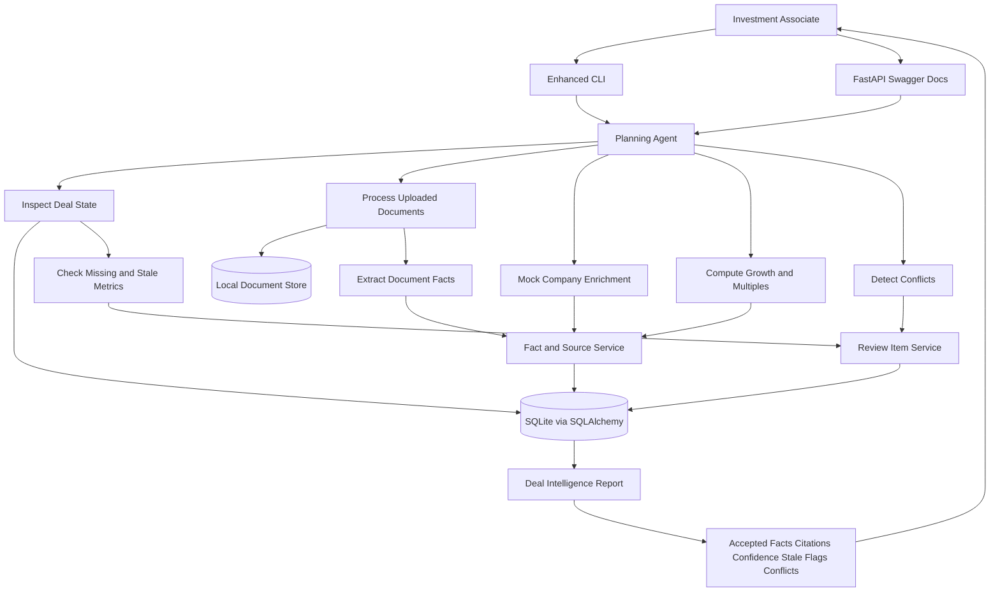
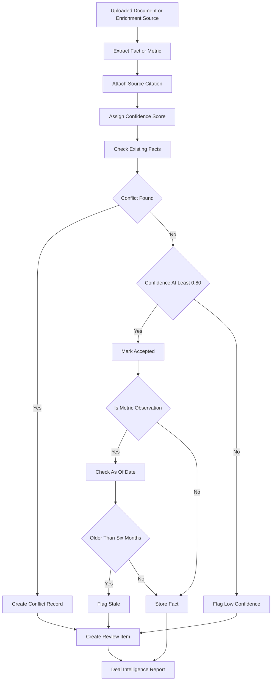

# AI Deal Room MVP - Initial Architecture Plan

> **Historical document.** This is the original pre-build plan describing the
> first deterministic orchestrator design. The agent has since gained an LLM
> reasoning loop and several correctness fixes. For the current design see
> `ARCHITECTURE.md`; for what changed and why see `AUDIT_AND_FIXES.md`.

## Goal

Design and prototype a lightweight internal AI Deal Room for an early-stage tech investing team. The MVP focuses exclusively on the Investment Associate/Analyst doing due diligence: collecting company information, processing deal documents, reconciling data quality issues, and producing a cited deal intelligence report.

The architecture pattern is an explicit orchestrator agent backed by a provenance-first data model. This keeps the prototype understandable, auditable, and small enough to build without diluting the case study's core data logic.

The strongest submission should include:

- A high-level system design diagram and concise architecture rationale.
- A provenance-first data model for deals, companies, documents, extracted facts, and evolving metrics.
- A small working prototype that demonstrates AI reducing manual deal research or document extraction.
- Clear assumptions, trade-offs, and human-review boundaries.

## Recommended MVP Scope

Build a command-line and simple FastAPI-backed prototype that supports one Associate workflow:

1. Create or load a deal for a company.
2. Attach one or more local documents, such as a pitch deck text export, memo, or term sheet sample.
3. Run a planning agent that decides whether to:
   - enrich the company profile,
   - extract structured document facts,
   - reconcile conflicting values,
   - compute derived metrics,
   - flag low-confidence fields for review.
4. Persist the resulting deal state, extracted facts, confidence scores, source citations, staleness flags, and review items.
5. Print or expose a concise Deal Intelligence Report for the Associate.

This is enough to demonstrate the end-to-end product loop without needing a polished UI, real file integrations, or paid data vendors. Streamlit can be a nice-to-have if the core CLI/FastAPI flow is already complete.

## What to Reuse From `bizops_takehome`

Reuse the architectural shape, not the recruiting domain logic:

- `src/parsers/`: keep the parser layer pattern for CSV/text/document inputs.
- `src/services/`: keep business logic isolated in services rather than route handlers or scripts.
- `src/database/`: reuse SQLAlchemy + SQLite for a local deterministic demo.
- Deterministic-first AI pattern: use rules/parsers first, then LLM fallback for ambiguous extraction or classification.
- Reconciliation pattern: persist matches/conflicts with confidence instead of overwriting silently.
- Validation/data-quality layer: make data quality visible as a product feature, not a background concern.
- Seed/reset scripts: make the demo reproducible in one command.

Avoid reusing:

- The full React frontend; it is more surface area than this exercise needs.
- Gmail/email orchestration; deal-room value is better shown through document and research workflows.
- Recruiting-specific stage automation; deal stages have different semantics and evidence requirements.

## Meaningful Divergence

This project should diverge from `bizops_takehome` in three important ways:

1. Provenance is central.
   Every important company fact should know where it came from: document, manual entry, web enrichment, computed metric, or agent inference.

2. Metrics are temporal.
   Company metrics like ARR, revenue, burn, headcount, valuation, and growth rate change over time. Model them as observations, not static columns on the company.

3. AI output is reviewable.
   The agent should not simply update the canonical record. It should create extracted facts, proposed updates, confidence scores, and review flags.

## High-Level Architecture



## Component Decisions

| Component | MVP Choice | Why |
|---|---|---|
| Interface | CLI first, optional FastAPI routes | Satisfies prototype requirement with less UI work. |
| Backend | Python services | Matches `bizops_takehome` and is fast for parsing, agents, and data work. |
| Database | SQLite + SQLAlchemy | Local, inspectable, easy to reset; enough for take-home scope. |
| Document store | Local `data/documents/` folder | Avoids cloud/file-system integration complexity. |
| AI layer | Tool-calling agent or explicit orchestrator | Demonstrates agent judgment while keeping behavior auditable. |
| Extraction | Deterministic regex/table parsing plus LLM fallback | More trustworthy and cheaper than LLM-only extraction. |
| Embeddings/vector search | Optional, not MVP-critical | Useful for semantic document Q&A, but not needed to prove structured extraction. |
| External data | Mock provider or small web lookup abstraction | Shows extensibility without depending on unreliable live integrations. |

## SQLAlchemy in This Plan

SQLAlchemy is the ORM, or Object-Relational Mapper. Instead of writing raw SQL strings like `SELECT * FROM deals WHERE id = 1`, the code works with Python classes and objects, such as `session.query(Deal).get(deal_id)`.

Under the hood, SQLAlchemy translates Python model classes into the database schema and converts object changes into `INSERT`, `UPDATE`, and `SELECT` statements for SQLite. For this MVP, it gives the submission a clean data model without spending time on manual SQL management. In production, the same ORM model pattern could move from SQLite to Postgres with less application-code churn.

## Proposed Data Model

Core entities:

- `companies`: durable company identity, website, sector, geography, current canonical summary.
- `deals`: investment opportunity tied to a company, stage, owner, priority, source, status.
- `deal_stage_events`: stage history, timestamps, owner, notes.
- `documents`: file metadata, deal link, document type, upload date, processing status.
- `document_chunks`: extracted text chunks with page/section references if available.
- `facts`: atomic extracted or enriched claims, such as `valuation = 80M` or `ARR = 12M`.
- `fact_sources`: links each fact to a document chunk, manual user, enrichment provider, or computation.
- `metric_observations`: time-series metrics for revenue, ARR, burn, headcount, valuation, etc.
- `computed_metrics`: derived values such as growth rate, revenue multiple, burn multiple.
- `conflicts`: competing facts for the same company/metric/time period.
- `agent_runs`: audit trail of agent objective, tools used, decisions, outputs, and errors.
- `review_items`: fields requiring human confirmation.

Important modeling choice:

Do not store only one `company.arr` or `company.valuation`. Store multiple observations with `as_of_date`, `source_id`, `confidence_score`, `review_status`, and `staleness_status`. A canonical value can be selected later from the best reviewed observation.

## Data Quality Rules

Auto-accept:

- The agent proposes facts by default.
- If a fact has high confidence, no active conflict, and a clear source citation, mark it `accepted`.
- Even accepted facts keep `source_id`, `source_citation`, `confidence_score`, and extraction metadata.
- If a contradiction exists, do not overwrite the current value; create a `conflict` and a `review_item`.

Confidence:

- Store `confidence_score` on every fact and metric observation.
- Use `0.80` as the MVP warning threshold.
- CLI output should highlight low-confidence values in yellow.
- Active conflicts should be highlighted in red.

Staleness:

- Store business metrics as `metric_observations` with both `as_of_date` and `created_at`.
- When the Deal Service builds the current deal state, it checks the latest `as_of_date`.
- If a metric is older than six months, mark it `stale` and surface it in the Associate report.
- Stale data is not necessarily wrong; it means the Associate should refresh or verify it before relying on it.



## Minimal Schema Sketch

```text
companies(company_id, name, website, sector, geography, created_at, updated_at)

deals(deal_id, company_id, stage, owner, source, priority, status,
      initial_contact, created_at, updated_at)

documents(document_id, deal_id, filename, doc_type, storage_path,
          uploaded_at, processed_at, processing_status)

facts(fact_id, company_id, deal_id, field_name, value_text, value_numeric,
      unit, currency, period_start, period_end, as_of_date,
      extraction_method, confidence_score, review_status, staleness_status,
      created_at)

metric_observations(metric_observation_id, company_id, deal_id, metric_name,
                    value_numeric, value_text, unit, currency, period_start,
                    period_end, as_of_date, source_id, confidence_score,
                    review_status, staleness_status, created_at)

fact_sources(source_id, fact_id, source_type, document_id, chunk_id,
             source_label, quoted_evidence, provider, url)

computed_metrics(metric_id, company_id, deal_id, metric_name, value_numeric,
                 formula, input_fact_ids, as_of_date, confidence)

conflicts(conflict_id, company_id, deal_id, field_name, period_start,
          period_end, fact_ids, severity, resolution_status)

agent_runs(run_id, deal_id, objective, status, tools_used, trace_json,
           started_at, completed_at)

review_items(review_id, deal_id, field_name, reason, candidate_fact_ids,
             priority, status, created_at)
```

## Agent Prototype

Recommended capability: `update_deal_intelligence`

Input:

```bash
python -m scripts.run_agent --company "Acme AI" --website "https://example.com" --docs data/documents/acme_pitch.txt
```

Planning-agent intelligence loop:

1. Inspect existing deal/company state.
2. Query `metric_observations` to identify missing or stale data.
3. Classify uploaded documents by type.
4. Extract structured facts from documents:
   - valuation,
   - revenue or ARR,
   - growth rate,
   - burn/runway,
   - headcount,
   - investors/customers,
   - financing round terms.
5. Enrich basic company metadata from a mocked provider:
   - sector,
   - description,
   - founding year,
   - headquarters,
   - employee range.
6. Compare new facts to existing observations.
7. Auto-accept high-confidence non-conflicting facts.
8. Compute derived metrics where inputs exist.
9. Create review items for conflicts, stale data, missing key fields, or low-confidence outputs.
10. Emit a Deal Intelligence Report with citations, confidence scores, stale flags, and review items.

Example tools:

- `extract_document_facts(document_id)`: returns structured facts with evidence.
- `enrich_company(company_id)`: returns company profile fields from a provider abstraction.
- `compute_metrics(company_id)`: computes growth, valuation multiple, burn multiple.
- `detect_conflicts(company_id)`: finds contradictory facts by field and period.
- `create_review_item(deal_id, reason, facts)`: records human review needs.

## Prototype Demonstration Options

Primary demo:

- Enhanced CLI output prints a Deal Intelligence Report.
- Use `colorama` or similar terminal coloring: yellow for low confidence or stale values, red for conflicts.
- This is the fastest way to show agent behavior, citations, and data-quality judgment.

Secondary demo:

- FastAPI Swagger UI at `/docs`.
- Trigger an agent run through an endpoint and show JSON output containing accepted facts, citations, confidence scores, stale flags, conflicts, and review items.
- This demonstrates the backend is structured like a real internal service without building a full frontend.

Optional demo:

- Streamlit dashboard if time remains.
- Use it for a simple Associate reconciliation table and a mock pipeline summary.
- Treat this as polish, not the core deliverable.

## Suggested File Structure

```text
shaw_takehome/
├── README.md
├── ARCHITECTURE.md
├── requirements.txt
├── data/
│   ├── seed_deals.csv
│   └── documents/
├── scripts/
│   ├── build_db.py
│   ├── reset_demo.py
│   └── run_agent.py
├── src/
│   ├── agents/
│   │   └── deal_research_agent.py
│   ├── api/
│   │   └── main.py
│   ├── database/
│   │   ├── connection.py
│   │   └── models.py
│   ├── parsers/
│   │   └── document_parser.py
│   ├── services/
│   │   ├── company_enrichment.py
│   │   ├── deal_service.py
│   │   ├── document_processing.py
│   │   ├── fact_service.py
│   │   ├── metric_service.py
│   │   └── conflict_service.py
│   └── tools/
│       └── deal_tools.py
└── tests/
```

## Implementation Plan

### Phase 1 - Design Artifacts

- Write `ARCHITECTURE.md` with the system diagram, component rationale, data model, and trade-offs.
- Write a concise README explaining how to run the prototype and what it demonstrates.
- Include assumptions and GenAI usage disclosure.

### Phase 2 - Data Foundation

- Create SQLAlchemy models for companies, deals, documents, facts, sources, conflicts, review items, and agent runs.
- Add a deterministic `scripts/build_db.py` seed flow.
- Add one or two synthetic early-stage company examples and local text documents.

### Phase 3 - Extraction and Quality

- Implement document parsing for `.txt` or markdown first.
- Add regex/rule-based extraction for common financial fields.
- Add LLM fallback only for fields that rules miss or ambiguous sections.
- Persist facts with confidence, evidence, review status, and stale status.

### Phase 4 - Agent Prototype

- Implement an explicit orchestrator agent with tool functions.
- Make it choose actions based on missing data and document availability.
- Record an `agent_run` trace with tools used and outputs.
- Auto-accept high-confidence non-conflicting facts.
- Print a final summary: accepted facts, stale metrics, low-confidence facts, conflicts, computed metrics, and review queue.

### Phase 5 - Tests and Demo Polish

- Test extraction on sample documents.
- Test conflict detection with two contradictory valuations or revenue figures.
- Test computed metrics from known inputs.
- Add a demo command that rebuilds the DB and runs the agent end to end.

## Assumptions to Narrow Scope

These assumptions should be stated explicitly in the final submission:

- The investment team focuses on early-stage technology companies.
- The only primary MVP user is an Investment Associate or Analyst.
- The MVP supports one investment team and a small portfolio, not firm-wide multi-tenant deployment.
- Documents are uploaded manually as local files; no SharePoint, Google Drive, or email integration in MVP.
- Document inputs are text or text-extractable files. Full PDF/OCR support is a future extension.
- External company enrichment can be mocked or implemented behind a provider interface.
- AI-generated facts can be auto-accepted when confidence is high and no conflict exists, but every value remains traceable to a source.
- Facts below `0.80` confidence, stale metrics older than six months, and active conflicts require Associate review.
- The system optimizes for traceability and trust over full automation.
- No confidential or real deal data is used in the prototype.

## Risks and Trade-Offs

- SQLite is appropriate for the take-home demo but would be replaced by Postgres in production.
- A CLI prototype is less visually impressive than a UI but better matches the 3-4 hour build constraint.
- LLM extraction can hallucinate; evidence quotes, confidence scores, and review items reduce this risk.
- Web enrichment may be brittle; abstract it so mocked data can demonstrate the design reliably.
- A vector database is tempting but not necessary unless document Q&A becomes the core demo.
- Auto-accept improves usability but must be limited to high-confidence, non-conflicting facts with clear source citations.

## Final Submission Angle

Position the system as a foundation for trustworthy AI-assisted deal operations:

- Centralized deal and document data.
- AI-assisted extraction and enrichment.
- Provenance-aware structured facts.
- Time-series company metrics.
- Computed investment metrics.
- Conflict detection and human review.
- Auditable agent runs.

This keeps the MVP concise while directly addressing the case study's system design, data modeling, and agent prototype requirements.

## GenAI Disclosure Draft

I used ChatGPT/Codex to help structure the architecture, compare it to a prior recruiting-operations project, and draft implementation scaffolding. I reviewed and edited the resulting design and code decisions myself, with particular attention to scope, data provenance, and reliability trade-offs.
